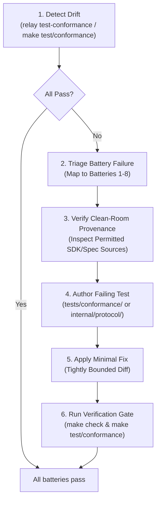

# Manage Conformance Drift

Orchestration skill for detecting, triaging, and remedying protocol and REST API
conformance drift between Relay and DBOS Conductor.

Relay targets wire, REST, and lifecycle compatibility with DBOS Conductor for
unmodified DBOS Transact applications and dbosctl REST endpoints. Compatibility
tiers are governed by docs/design/compatibility-tiers.md and the current
measured state is recorded in tests/verifysdk/REPORT.md. When upstream SDKs or
specifications evolve, this skill guides an agent through disciplined, clean-room
compliant drift resolution.

## Workflow Overview



---

## 1. Detect Drift

Run the automated conformance suite against the target environment:

- **Local In-Process**:
  ```bash
  make test/conformance
  ```
- **Live Local Server**:
  ```bash
  ./bin/relay test-conformance --target http://localhost:8090 --key "$RELAY_API_KEY"
  ```
- **Generate Markdown Scorecard**:
  ```bash
  ./bin/relay test-conformance --target http://localhost:8090 --key "$RELAY_API_KEY" --report scorecard.md
  ```

For specification drift without a running server, verify OpenAPI codegen drift:
```bash
make drift
```

---

## 2. Triage Battery Failure

When a test fails, identify the owning battery (1 through 8) and component:

| Battery | Focus Area | Owning Package |
| :---: | :--- | :--- |
| **B1** | Health, OpenAPI, Metrics, Docs | `internal/api/`, `api/spec/`, `internal/metrics/` |
| **B2** | WebSocket Upgrade, Auth, Registration | `internal/hub/`, `internal/store/` |
| **B3** | Observability (Workflows, Steps) | `internal/router/`, `internal/protocol/`, `internal/api/` |
| **B4** | Workflow Controls (Cancel, Resume, Restart) | `internal/api/workflows_write.go`, `internal/protocol/` |
| **B5** | Queues & Schedules | `internal/api/queues.go`, `schedules.go`, `internal/protocol/` |
| **B6** | Recovery & Liveness Lifecycle | `internal/liveness/`, `internal/hub/` |
| **B7** | Alerting Rules Management | `internal/api/apps.go`, `internal/alerting/` |
| **B8** | RFC 9457 Problem Details & Route Gating | `internal/problem/`, `internal/api/oidc_stubs.go` |

> [!TIP]
> For in-depth battery contracts, required payload shapes, and status codes,
> consult [references/batteries.md](references/batteries.md).
>
> For root-cause classification and refinement patterns across common failure
> signatures, consult [references/triage-playbook.md](references/triage-playbook.md).

---

## 3. Verify Clean-Room Provenance

Before modifying any protocol code or docs, identify the permitted upstream
source proving the expected behavior:

1. **Permitted Sources Only**: Consult [Clean-Room Rules](../../../docs/contribution/clean-room.md) (`docs/contribution/clean-room.md`)
   for the canonical list of permitted and forbidden sources. Per-fact commit pins
   are maintained in `docs/discovery/provenance.md`.
2. Every wire message struct in `internal/protocol/messages.go` must maintain
   its provenance comment naming repository, path, and commit hash.

> [!IMPORTANT]
> Detailed source locations, commit pinning, and citation templates are
> documented in [references/clean-room-sources.md](references/clean-room-sources.md).

---

## 4. Scoped Test-Driven refinement

1. **Scope Statement**: Formulate a strict 1-sentence scope before editing:
   `Fix <defect> in <package> to restore Battery <N> conformance.`
2. **Dedicated Worktree**:
   Create a dedicated worktree and conventional branch:
   ```bash
   git worktree add -b fix/conformance-<topic> .worktrees/fix-conformance-<topic> main
   ```
3. **Write Failing Test First**:
   Add a test reproducing the failure in `tests/conformance/` or the owning package.
   Run `go test` and observe the test failure.
4. **Minimal Fix**:
   Edit only the necessary fields or routing logic. Avoid incidental refactoring
   or unnecessary dependency updates.

> [!NOTE]
> A step-by-step example of detecting a field mismatch, writing a test, and
> applying a minimal fix is provided in
> [examples/drift-refinement.md](examples/drift-refinement.md).

---

## 5. Verification Gate

Execute the quality gate to certify the change:

```bash
make check
make test/conformance
```

Ensure:
- Pre-commit hooks pass (no em-dashes, no host paths, OKF v0.2 valid).
- Linters pass with 0 issues (`golangci-lint run`).
- Code drift check succeeds (`make drift`).
- Conformance suite passes 100%.
- If observable behavior changed, update `docs/` and record the change in
  `docs/log.md`.
