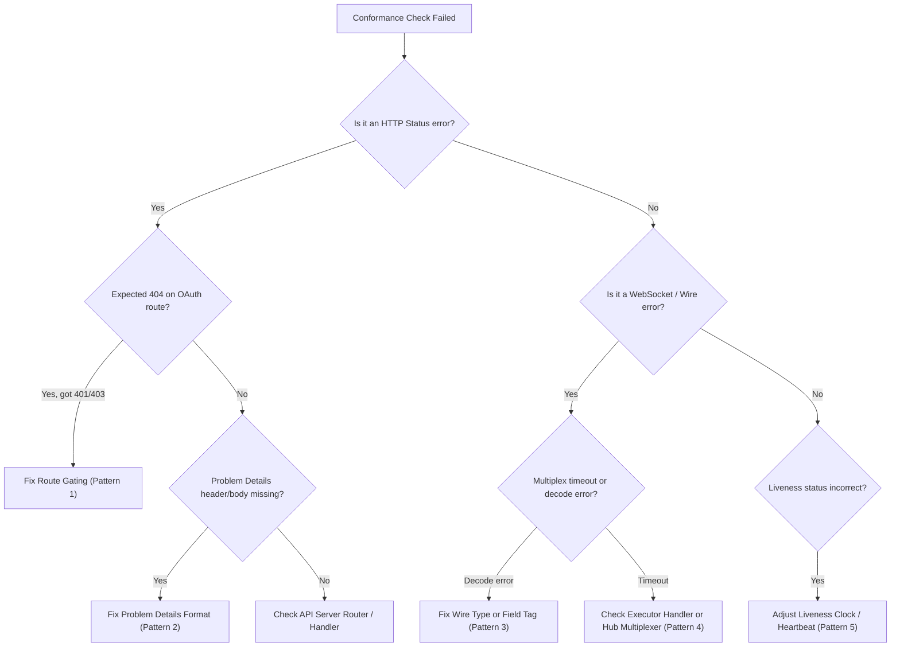

# Conformance Triage Playbook

Structured playbook for triaging and resolving common protocol and API
conformance failures in Relay.

---

## 1. Triage Decision Tree



---

## 2. Common Failure Signatures & refinement

### Pattern 1: Route Gating Mismatch (OAuth routes return 401/403 instead of 404)

- **Symptom**: `Battery 8` check fails because `GET /v2/users/me` or `/v2/orgs/{org}/roles`
  returns HTTP 401 Unauthorized or HTTP 403 Forbidden instead of HTTP 404 Not Found.
- **Root Cause**: Upstream `dbosctl` and self-hosted instances expect OAuth-gated
  routes to be completely unregistered (returning 404 Problem Details) when
  operating in unauthenticated mode (`RELAY_OIDC_ISSUER` unset).
- **refinement**:
  1. Inspect `internal/api/oidc_stubs.go`.
  2. Ensure the handler checks `s.authEnabled`. If false, write RFC 9457 HTTP 404
     Problem Details immediately without checking credentials.

---

### Pattern 2: RFC 9457 Problem Details Schema Divergence

- **Symptom**: REST endpoint returns an error status (e.g. 400 or 404), but
  `Content-Type` is `text/plain` or JSON body lacks required fields (`title`,
  `status`, `type`).
- **Root Cause**: Handler used `http.Error` or raw `json.Marshal` rather than the
  centralized `problem` package.
- **refinement**:
  Use `problem.Write` with the typed `problem.Problem` struct:
  ```go
  problem.Write(w, &problem.Problem{
      Type:   problem.TypeBadRequest,
      Title:  "Invalid JSON payload",
      Status: http.StatusBadRequest,
      Detail: err.Error(),
  })
  ```

---

### Pattern 3: Wire Field Casing or Type Divergence

- **Symptom**: Executor receives request or sends reply, but Relay decodes empty
  fields or fails with JSON unmarshaling errors.
- **Root Cause**: Upstream SDK defines wire struct fields with specific casing
  (e.g. PascalCase vs camelCase, or single string vs array of strings).
- **refinement**:
  1. Locate the provenance comment in `internal/protocol/messages.go`.
  2. Inspect the upstream SDK file (e.g. `conductor_protocol.go` in Go SDK).
  3. If a field accepts both single strings and string lists, use the
     `protocol.StringOrList` type.
  4. Verify exact JSON tag: `` `json:"WorkflowUUID"` `` vs `` `json:"workflow_id"` ``.

---

### Pattern 4: Multiplexing Correlation Timeout

- **Symptom**: REST endpoint times out waiting for executor response (HTTP 504
  Gateway Timeout), even though executor is connected.
- **Root Cause**:
  - Request ID was not propagated into response envelope.
  - Wire message type constant in Relay does not match string emitted by executor.
  - Response frame was swallowed by connection read loop.
- **refinement**:
  1. Check message type string constant in `internal/protocol/envelope.go`.
  2. Ensure `ExecutorConn` routes the message to `Multiplexer.RouteResponse(msg)`.
  3. Check that `req.RequestID` is passed into `resp.Envelope.RequestID`.

---

### Pattern 5: Liveness & Disconnect Timing

- **Symptom**: `Battery 6` disconnect detection fails because executor remains
  `HEALTHY` long after socket closure.
- **Root Cause**: Disconnect event not propagated from WebSocket close handler to
  `store.Queries().DisconnectExecutor`.
- **refinement**:
  Ensure `ExecutorConn.Close()` or read loop termination directly notifies the
  registry to mark status as `disconnected` in Postgres.
