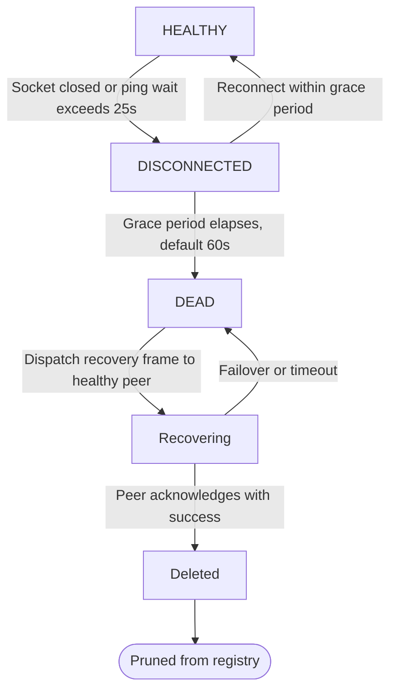

# Recovery

Recovery is the reason a control plane exists. An application on its own
recovers workflows when the process that owned them restarts. With a control
plane, another executor picks them up instead, so a machine that never comes
back does not strand its work.

## The state machine

Each executor registration transitions through four discrete lifecycle states:

1. **Connected (`HEALTHY`)**: The executor maintains an active WebSocket connection responding to heartbeat frames.
2. **Disconnected (`DISCONNECTED`)**: The WebSocket connection is closed or times out (after exceeding the 25-second server ping wait). A per-application grace period timer begins (`executorTimeoutSecs`, default 60 seconds). If the executor reconnects presenting the same `executor_id` before expiry, it returns to `HEALTHY`.
3. **Dead (`DEAD`)**: The grace period elapses without reconnection. Relay marks the executor `DEAD` and initiates workflow recovery dispatch.
4. **Deleted**: Once recovery is acknowledged by an active peer, the dead executor record is pruned from the registry.

A dead executor's work is offered to a healthy peer executor belonging to the same application and organisation, preferring one running the same application version. Relay asks that peer to recover the dead executor's workflows by dispatching a `recovery` frame (`executor_ids: [dead_executor_id]`). On a successful reply (`success: true`), Relay deletes the dead executor's record and writes the action to the audit log. On failure, peer disconnect, or acknowledgement timeout, Relay fails over sequentially to the next healthy candidate with backoff. If no healthy peers are connected or willing to adopt, the executor remains in `DEAD` status until a healthy peer joins.

## Rules

- Recovery is idempotent by design. The public documentation describes the
  library's guarantees as at-least-once for steps and exactly-once for
  outcomes, which makes a duplicated recovery request cheap. Prefer sending it
  twice over never sending it. This guarantee is validated across test suites
  and chaos scenarios. Recovery re-enqueue in the SDK system database is
  scoped to rows with status PENDING, ensuring duplicate recovery dispatches
  do not corrupt execution state.
- Never recover across applications or organisations, and never to an executor
  of a different application name.
- If no healthy executor runs the dead executor's version, recovery to the
  latest version happens only when the application's settings allow it.
  Otherwise Relay surfaces the situation and waits for a human.
- Exactly one instance runs the timers for a given executor: the one that owns
  the connection. If that instance dies, another may adopt its orphaned
  executors once the lease expires.
- Every recovery action is written to the audit log.

## How this gets proven

Not by unit tests alone. The gate for this tier is a chaos harness: several
executors of one application against a shared system database, a workload
generator whose workflows leave observable evidence, a killer that terminates
executors on a schedule, and a check that every started workflow reaches a
terminal state exactly once. It runs in CI for any change to liveness or
routing.

## Liveness and timing parameters

Relay implements the normative timing parameters defined in the executor protocol specification:

* **Grace period timeout**: Default 60 seconds (`executorTimeoutSecs`), configurable per application in `relay.yaml` or overridden via application conductor settings (`PATCH /v2/orgs/{orgName}/apps/{appName}`).
* **Server ping interval**: 10 seconds (`pingInterval` in `internal/hub/conn.go`), matching the protocol specification.
* **Client ping interval**: 20 seconds default across DBOS Transact SDKs.
* **Server ping wait**: 25 seconds (`executorPingWait`), after which an unresponsive connection transitions to `DISCONNECTED`.
* **Client pong timeout**: 15 seconds (Python, TypeScript, Java) or 30 seconds (Go).
* **Reconnect backoff**: 1 second initial delay with exponential backoff up to 30 seconds.

When an executor connection is interrupted and the grace period elapses without reconnection, the executor is declared `DEAD`, and its orphaned workflows are scheduled for recovery dispatch to a healthy peer.
